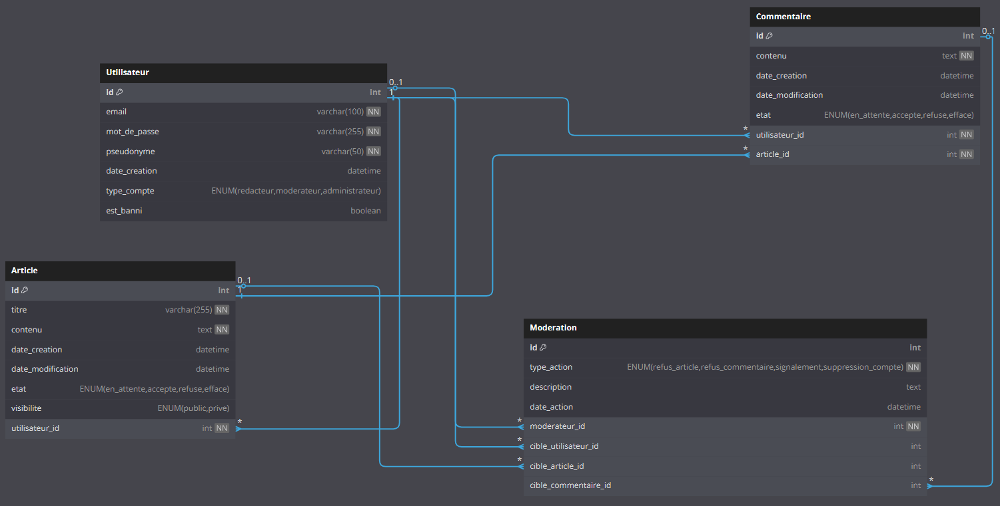

# Structure de la base de données

## Schéma relationnel



## Tables principales

### Utilisateur

| Colonne       | Type         | Description                                 |
| ------------- | ------------ | ------------------------------------------- |
| id            | INT          | Clé primaire, auto-increment                |
| email         | VARCHAR(100) | Email unique de l'utilisateur               |
| mot_de_passe  | VARCHAR(255) | Mot de passe hashé                          |
| pseudonyme    | VARCHAR(50)  | Nom d'affichage                             |
| date_creation | DATETIME     | Date de création du compte                  |
| type_compte   | ENUM         | 'redacteur', 'moderateur', 'administrateur' |
| est_banni     | BOOLEAN      | Indique si le compte est banni              |

### Article

| Colonne           | Type         | Description                                 |
| ----------------- | ------------ | ------------------------------------------- |
| id                | INT          | Clé primaire, auto-increment                |
| titre             | VARCHAR(255) | Titre de l'article                          |
| contenu           | TEXT         | Contenu de l'article                        |
| date_creation     | DATETIME     | Date de création                            |
| date_modification | DATETIME     | Date de dernière modification               |
| etat              | ENUM         | 'en_attente', 'accepte', 'refuse', 'efface' |
| visibilite        | ENUM         | 'public', 'prive'                           |
| utilisateur_id    | INT          | ID de l'auteur (FK)                         |

### Commentaire

| Colonne           | Type     | Description                                 |
| ----------------- | -------- | ------------------------------------------- |
| id                | INT      | Clé primaire, auto-increment                |
| contenu           | TEXT     | Contenu du commentaire                      |
| date_creation     | DATETIME | Date de création                            |
| date_modification | DATETIME | Date de dernière modification               |
| etat              | ENUM     | 'en_attente', 'accepte', 'refuse', 'efface' |
| utilisateur_id    | INT      | ID de l'auteur (FK)                         |
| article_id        | INT      | ID de l'article commenté (FK)               |

### Moderation (Bonus)

| Colonne              | Type     | Description                              |
| -------------------- | -------- | ---------------------------------------- |
| id                   | INT      | Clé primaire, auto-increment             |
| type_action          | ENUM     | Type d'action de modération              |
| description          | TEXT     | Raison de la modération                  |
| date_action          | DATETIME | Date de l'action                         |
| moderateur_id        | INT      | ID du modérateur (FK)                    |
| cible_utilisateur_id | INT      | ID de l'utilisateur ciblé (FK, nullable) |
| cible_article_id     | INT      | ID de l'article ciblé (FK, nullable)     |
| cible_commentaire_id | INT      | ID du commentaire ciblé (FK, nullable)   |

## Script SQL

```sql
CREATE TABLE Utilisateur (
id INT PRIMARY KEY AUTO_INCREMENT,
email VARCHAR(100) UNIQUE NOT NULL,
mot_de_passe VARCHAR(255) NOT NULL,
pseudonyme VARCHAR(50) NOT NULL,
date_creation DATETIME DEFAULT CURRENT_TIMESTAMP,
type_compte ENUM('redacteur', 'moderateur', 'administrateur') DEFAULT 'redacteur',
est_banni BOOLEAN DEFAULT FALSE
);

CREATE TABLE Article (
id INT PRIMARY KEY AUTO_INCREMENT,
titre VARCHAR(255) NOT NULL,
contenu TEXT NOT NULL,
date_creation DATETIME DEFAULT CURRENT_TIMESTAMP,
date_modification DATETIME DEFAULT CURRENT_TIMESTAMP ON UPDATE CURRENT_TIMESTAMP,
etat ENUM('en_attente', 'accepte', 'refuse', 'efface') DEFAULT 'en_attente',
visibilite ENUM('public', 'prive') DEFAULT 'public',
utilisateur_id INT NOT NULL,
FOREIGN KEY (utilisateur_id) REFERENCES Utilisateur(id)
);

CREATE TABLE Commentaire (
id INT PRIMARY KEY AUTO_INCREMENT,
contenu TEXT NOT NULL,
date_creation DATETIME DEFAULT CURRENT_TIMESTAMP,
date_modification DATETIME DEFAULT CURRENT_TIMESTAMP ON UPDATE CURRENT_TIMESTAMP,
etat ENUM('en_attente', 'accepte', 'refuse', 'efface') DEFAULT 'en_attente',
utilisateur_id INT NOT NULL,
article_id INT NOT NULL,
FOREIGN KEY (utilisateur_id) REFERENCES Utilisateur(id),
FOREIGN KEY (article_id) REFERENCES Article(id)
);

CREATE TABLE Moderation (
id INT PRIMARY KEY AUTO_INCREMENT,
type_action ENUM('refus_article', 'refus_commentaire', 'signalement', 'suppression_compte'),
description TEXT,
date_action DATETIME DEFAULT CURRENT_TIMESTAMP,
moderateur_id INT NOT NULL,
cible_utilisateur_id INT,
cible_article_id INT,
cible_commentaire_id INT,
FOREIGN KEY (moderateur_id) REFERENCES Utilisateur(id),
FOREIGN KEY (cible_utilisateur_id) REFERENCES Utilisateur(id),
FOREIGN KEY (cible_article_id) REFERENCES Article(id),
FOREIGN KEY (cible_commentaire_id) REFERENCES Commentaire(id)
);
```
